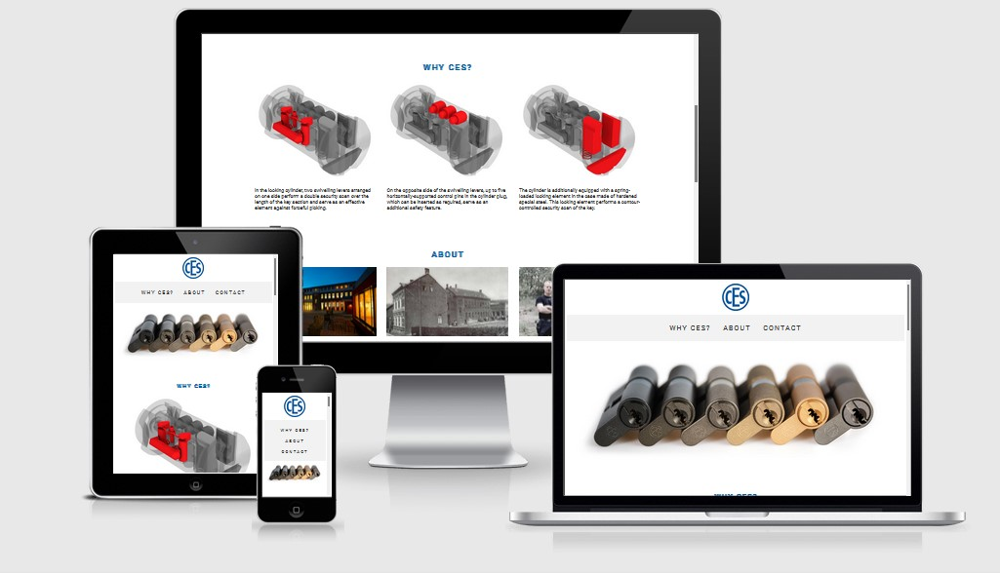

# CES UDM
This site is intended to show the benefits of the lock CES UDM. It will show some unique features it has. The site also have a contact form so it will be easy to contact us and get more information about prices and other information. The site will also have an about section that will build trust towards the customers.

The target for this site is other companies such as real estate owners, schools, hospitals and other companies that have a lot of doors and on need of big and complex locking system.

Welcome to [CES UDM](https://spangen87.github.io/rikard-spangmyr/).

## Features

### Existing features
#### Navigation Bar
- A navigation bar with links to the diffrent sections on the page. Home, Why CES?, About and Contact Us.
- This will make it easier to navigate to preffered part of the page.

#### Hero image
- An image that covers the full width of the site and that is fully responsive. 
- This section gives the user a feel for the quality of the locks and what high end finishes that are available.

#### Why CES?
- Three sections with a picture to each section. Shows what is unique with this lock and what safety functions there is.
- Gives the user a quick overview with short text and descriptive images.

#### About
- Here the history av the company is presented with text and three pictures of the present and today. A video from the comapny shows some refereces for buildings using the locks today and some stories from the company.
- The section aims to build trust towards the visitor by showing that they are developing all the time and have been around for nearly 200 years.
- One of the pictures shows the Swedish team working with CES.

#### Contact Us
- This section gives the user an easy way to contact the company and see where it's located.
- There is a form to fill out with a message to the company to show that they are interested and want to know more. The form is for educational purpuse and no mail will be sent when submitting. The form has four fields to fill out which are required
- There is also a map helping the visitor find the company if they want to visit in person. This address is real, but it's for educational reason, and no sales are made at this address.

#### Footer
- The footer section shows the address, mail and phone number to the company.
- Below there is icons with links to social media pages. Those are for educational purpuse and will only link to the starting page for each social media.
- There is also an icon to send an direct email to the company. This link will open the deafult email program for the visitor. This email is real and is working.

## Testing

## Bugs
### Solved
- Found a bug that made ul in nav not completely in the center on smaller screens. I used dev tools to found that there was a padding to the left of the ul that made the distortion. Solved the problem by just adding padding 0 to the ul.

## Deployment

## Credits
### Content
- The font is picked from [Google Fonts](https://fonts.google.com/).
- The icons came from [Font Awesome](https://fontawesome.com/).
- The video is embedded from [Youtube](https://www.youtube.com/).
- The map is embedded from [Google Maps](https://www.google.com/maps).
- Some text pieces is from the original site for [CES](https://www.ces.eu/).
- Insipration to the form validating page was given from my mentor [Precious Ijege](https://www.linkedin.com/in/precious-ijege-908a00168/) and from this repository on [GitHub](https://github.com/EwanColquhoun/wawaswoods).

### Media
- Photos are all from [CES](https://www.ces.eu/) exept from the picture of the team in the about section. That foto is taken an edited by the developer [Rikard Spångmyr](https://www.linkedin.com/in/rikard-sp%C3%A5ngmyr-126ab436/).
- Photos were compressed using [TinyPNG](https://tinypng.com/).
- The photos that needed editing is edited in [Adobe Photoshop](https://www.adobe.com/se/products/photoshop.html).
### Code?
