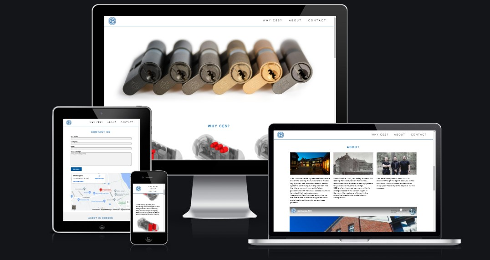
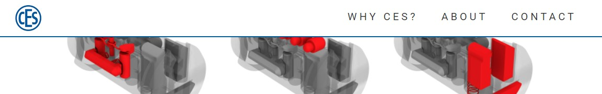
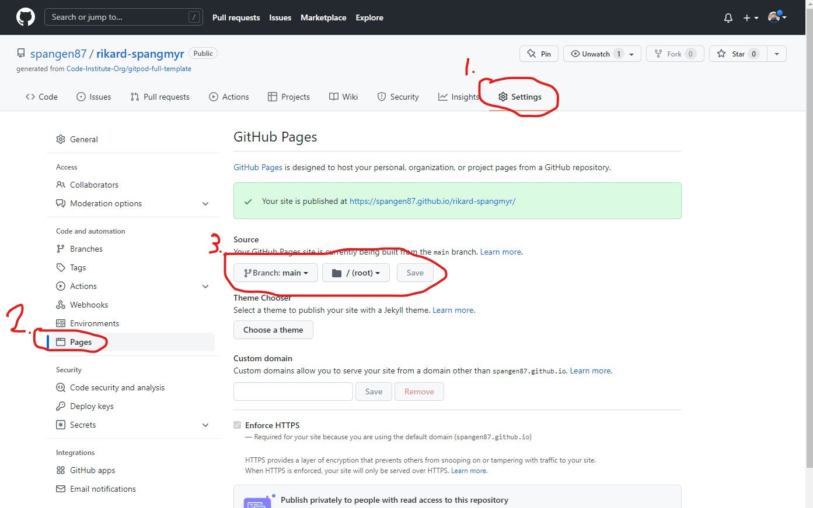

# CES UDM
This site is intended to show the benefits of the lock CES UDM. It will show some unique features it has. The site also have a contact form so it will be easy to contact us and get more information about prices and other information. The site will also have an about section that will build trust towards the customers.

The target for this site is other companies such as real estate owners, schools, hospitals and other companies that have a lot of doors and on need of big and complex locking system.

Welcome to [CES UDM](https://spangen87.github.io/rikard-spangmyr/).

## Contents
- [User Experience (UX)](#user-experience-ux)
    - [Wireframes](#wireframes)
    - [Site Structure](#site-structure)
    - [Design Choices](#design-choices)
        - [Typography](#typography)
        - [Colors](#colors)
- [Features](#features)
    - [Existing Features](#existing-features)
        - [Navigation Bar](#navigation-bar)
        - [Hero Image](#hero-image) 
        - [Why CES?](#why-ces)
        - [About](#about)
        - [Contact](#contact-us)
        - [Footer](#footer)
        - [Form Confirmation Page](#form-confirmation-page)
    - [Future Features](#future-features)
- [Technologies Used](#technoligies-used)
- [Testing](#testing)
    - [Browser Testing](#browser-testing)
    - [Responsiveness Test](#responsiveness-test)
    - [Accessibility Testing](#accessibility-testing)
    - [Validator Testing](#validator-testing)   
- [Bugs](#bugs)
    - [Solved](#solved)
- [Deployment](#deployment)
    - [To Deploy The Project](#to-deploy-the-project)
    - [Forking The Repository On GitHub](#forking-the-repository-on-github)
    - [How To Clone The Project](#how-to-clone-the-project)   
- [Credits](#credits)
    - [Content](#content)
    - [Media](#media)
- [Acknowledgements](#acknowledgements)    

## User Experience (UX)
### Wireframes
Wireframing was done before the project started. Some changes has been made on the way because it looked better on different screen sizes. And it is now following the same proportions through the site.

 
 

[Back to top](#contents)
### Site Structure
The CES UDM page have one scrollable page with three sections: [Why CES?](https://spangen87.github.io/rikard-spangmyr/#why-ces), [About](https://spangen87.github.io/rikard-spangmyr/#about) and [Contact](https://spangen87.github.io/rikard-spangmyr/#about). Each section is linked in the header navigation meny. There is also one more page that confirms that you have filled out the form, [Contact Confirmation](https://spangen87.github.io/rikard-spangmyr/contact-confirmation.html).
The sections order is considered when deciding the visitors journey through the site. The Why CES should build an interest of the products, the About section should build some trust and finally the Contact section where the visitor can take the step to make contact if it's interesting to them.

[Back to top](#contents)
### Design Choices
#### Typography
I choosed to use Roboto on the whole site. I wanted a clean look to the text and thought that Roboto was a good choice. To give the headings some additional styling I made them all uppercase and gave them some spacing between letters.

[Back to top](#contents)
#### Colors
Since CES already have a color on the logo, I used that in the color scheme of the site. Then I wanted to complement with some subtile colors and choosed a very light grey and also a dark grey color.

[Back to top](#contents)
## Features

### Existing Features
#### Navigation Bar
- A navigation bar with links to the different sections on the page. Why CES?, About and Contact Us.
- This will make it easier to navigate to preferred part of the page.
- Made the navigation bar sticky to the top so it will be easier to navigate when scrolling down.

[Back to top](#contents)
#### Hero image
- An image that covers the full width of the site and that is fully responsive. 
- This section gives the user a feel for the quality of the locks and what high end finishes that are available.

[Back to top](#contents)
#### Why CES?
- Three sections with a picture to each section. Shows what is unique with this lock and what safety functions there is.
- Gives the user a quick overview with short text and descriptive images.

[Back to top](#contents)
#### About
- Here the history of the company is presented with text and three pictures of the present and today. A video from the company shows some refereces for buildings using the locks today and some stories from the company.
- The section aims to build trust towards the visitor by showing that they are developing all the time and have been around for nearly 200 years.
- One of the pictures shows the Swedish team working with CES.

[Back to top](#contents)
#### Contact Us
- This section gives the user an easy way to contact the company and see where it's located.
- There is a form to fill out with a message to the company to show that they are interested and want to know more. The form is for educational purpuse and no email will be sent when submitting. The form has four fields to fill out which are all required.
- There is also a map helping the visitor find the company if they want to visit in person. This address is real, but it's for educational reason, and no sales are made at this address.

[Back to top](#contents)
#### Footer
- The footer section shows the address, mail and phone number to the company.
- Below there is icons with links to social media pages. Those are for educational purpose and will only link to the starting page for each social media.
- There is also an icon to send an direct email to the company. This link will open the deafult email program for the visitor. This email is real and is working.

[Back to top](#contents)
#### Form Confirmation Page
- This page validates the form input. There is no function for collectiong the data entered at this point. 
- There is a link back to the index page so you don't need to use the back button in the browser. If you click the logo in the top it will also bring you back to index page.

[Back to top](#contents)
### Future Features
- A working form that collects the data and sends an email to the company.
- A shop page where you can buy simple single lockings directly from the page. This would need an e-commerce platform.

[Back to top](#contents)
## Technoligies Used
- [HTML](https://html.spec.whatwg.org/) - is setting the structure and the content of the website.
- [CSS](https://www.w3.org/Style/CSS/Overview.en.html) - providing the style for the pages.
- [Gitpod](https://www.gitpod.io/#get-started) - used to develop and deploy the site.
- [GitHub](https://github.com/)  - is used to host the site.
- [Balsamiq](https://balsamiq.com/wireframes/) - was used to make the wireframes.

[Back to top](#contents)
## Testing
### Browser Testing
- Tests on Safari for MacOS was made through [Browserstack](https://live.browserstack.com/) because I had no computer with MacOS available in the process.
- Google Chrome was used during the develpment and there is no known issues in that browser.
- The compability with Mozilla Firefox is tested through the development. No known issues in that browser.
- Microsoft Edge is also tested with no known issues.

[Back to top](#contents)
### Responsiveness Test
The responsive design for mobile devices is tested with [Googles Mobile Friendly Test](https://search.google.com/test/mobile-friendly).
Manual testing is also made with [Google Chrome DevTools](https://developers.google.com/web/tools). In DevTools I have checked that screens with width from 2560px down to 375px looks good and working properly.

[Back to top](#contents)
### Accessibility Testing
The accessibility was tested using [Lighthouse](https://developers.google.com/web/tools/lighthouse).
- Performance shows how the page perform in terms of loading speed.
- Acessibility shows how accessible the page are for all users.
- Best Practices shows that the site uses industry standard practices.
- SEO shows Search Engine Optimisation.

Results for [CES UDM](https://spangen87.github.io/rikard-spangmyr/index.html) page:

[Back to top](#contents)
### Validator Testing
The site is tested with [W3C HTML Validator](https://validator.w3.org/) for the HTML and for the CSS with [W3C CSS Validator](https://jigsaw.w3.org/css-validator/).
At first there were a couple of minor errors, mostly typos that were easy to fix. 

Here is the results:

## Bugs
### Solved
- Found a bug that made ul in nav not completely in the center on smaller screens. I used dev tools to found that there was a padding to the left of the ul that made the distortion. Solved the problem by just adding padding 0 to the ul.
- When doing the validation i realized i had put the script for [Font Awesome](https://fontawesome.com/) below the body. The issued was fixed by moving it inside the body at the bottom instead.
- In the validating of the CSS file I found out that I had forgot to add size for the font at one place. The fix was simply to add the size in correct format.

[Back to top](#contents)
## Deployment
### To deploy the project
This site is deployed using GitHub pages. This is the steps for deploying a site.
1. When in the repository navigate to the Settings tab.
2. Then navigate to the Pages link on the left side.
3. Navigate to Source and select master/main branch and then click Save.
4. When page is refreshed and the site is published successfully, a green box will show that it's finished.

Here is the link to the repository: [https://github.com/spangen87/rikard-spangmyr](https://github.com/spangen87/rikard-spangmyr)

[Back to top](#contents)
### Forking the repository on GitHub
A copy of the repository can be made. This copy can be viewed and changed on an other account without affecting the original repository.

The steps for doing this:
1. Make sure you are logged in on GitHub and then find the repository.
2. On the top right there is a button called Fork.
3. Press the Fork button to make a copy to your account.

[Back to top](#contents)
### How to clone the project
This is how you make a clone of the repository:

1. Click on the code tab under the repository name.
2. Then click on "Code" button to the right above the files listed.
3. Click on the clipboard icon to copy the URL.

4. Open Git Bash in the IDE of your choice.
5. Change the working directory to where you want your cloned directory.
6. Type `git clone` and then paste the URL that you copied.
7. Press enter and clone has been finished.

[Back to top](#contents)
## Credits
### Content
- The font is picked from [Google Fonts](https://fonts.google.com/).
- The icons came from [Font Awesome](https://fontawesome.com/).
- The video is embedded from [Youtube](https://www.youtube.com/).
- The map is embedded from [Google Maps](https://www.google.com/maps).
- Some text pieces is from the original site for [CES](https://www.ces.eu/).
- Insipration to the form validating page was given from my mentor [Precious Ijege](https://www.linkedin.com/in/precious-ijege-908a00168/) and from this repository on [GitHub](https://github.com/EwanColquhoun/wawaswoods).

[Back to top](#contents)
### Media
- Photos are all from [CES](https://www.ces.eu/) exept from the picture of the team in the about section. That foto is taken an edited by the developer [Rikard Spångmyr](https://www.linkedin.com/in/rikard-sp%C3%A5ngmyr-126ab436/).
- Photos were compressed using [TinyPNG](https://tinypng.com/).
- The photos that needed editing is edited in [Adobe Photoshop](https://www.adobe.com/se/products/photoshop.html).

[Back to top](#contents)
## Acknowledgements
This site was made as Portfolio Project 1 for the Full Stack Software Developer education at [Code Institute](https://codeinstitute.net/). I would like to thank the community and my classmates from Slack for support and also Code Institute for good learning that helped me finish this. A big thanks to my mentor [Precious Ijege](https://www.linkedin.com/in/precious-ijege-908a00168/) for helping me sorting out my thoughts and that you made me push myself until the end of this project.

I would also like to thank my colleagus Daniel and Järker at [Best Las](https://bestlas.se/) for giving me the opportunity and time neccessary to be able to do this education.

CES is a real company in Germany, and we at Best Las sell their products in Sweden. This page, or parts of it, will probably be used in some form at the company in the future.

Rikard Spångmyr, 2022

[Back to top](#contents)